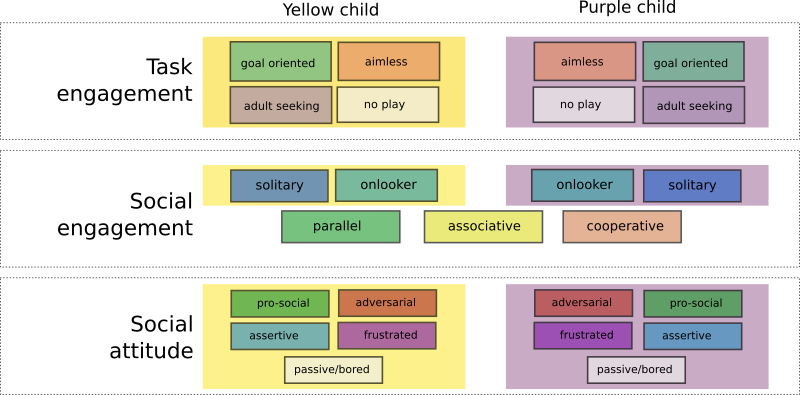

Coding scheme
=============

Social interactions are annotated using a dedicated [annotation
tool](https://github.com/freeplay-sandbox/annotator/). The following annotations
are made, for each child:

Commonly observed social dynamics are mapped to these constructs.
For instance, a sequence during which a child appears to be bored is annotated
as *passive*; an annoyed child would be *frustrated*, and the child being
annoying can be labelled as exhibiting an *adversarial* behaviour.

Other example include: a gentle hand grabbing would be *assertive* vs a
not-so-gentle hand grabbing that would be *adversarial*; manipulative or bossy
behaviours are labelled as *assertive*; when children laugh together, they
exhibit a *pro-social* attitude, etc.

We detail hereafter the exact meaning of these categories.

Task Engagement
---------------

| Construct             | Details                                                                |
|-----------------------|------------------------------------------------------------------------|
| goal-oriented         | purposeful play, implicit action planning, structured play             |
| aimless               | unstructured play, silly play                                          |
| adult seeking         | ask question, seek approval                                            |
| no play               | does not perform any obvious activity                                  |

Note that *structured* play might or might no be be on topic: a structured
activity unrelated to the offered touchscreen/drawing activity should still be
labelled as *goal-oriented*.

Social Engagement
-----------------

| Construct             | Details                                                                       |
|-----------------------|-------------------------------------------------------------------------------|
| solitary play         |                                                                               |
| onlooker              | child looking at the other for a prolongated period of time, without engaging |
| parallel play         |                                                                               |
| associative play      |                                                                               |
| cooperative play      |                                                                               |

Social attitude
---------------

| Construct             | Details                                                                   |
|-----------------------|---------------------------------------------------------------------------|
| pro-social            |                                                                           |
| adversarial           |                                                                           |
| assertive             |                                                                           |
| frustrated            |                                                                           |
| passive               |                                                                           | 

