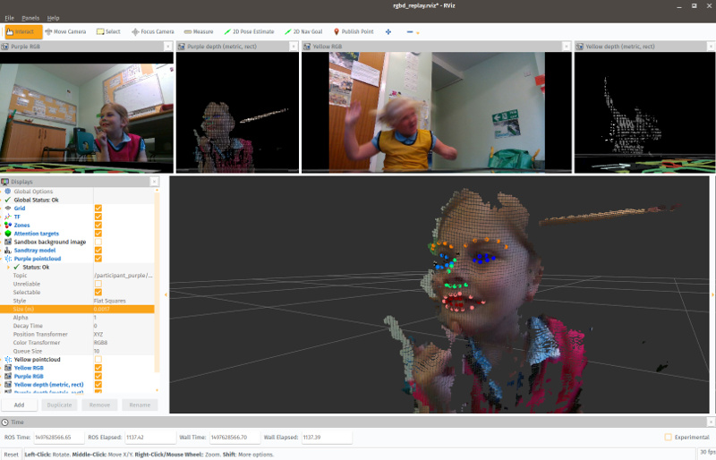
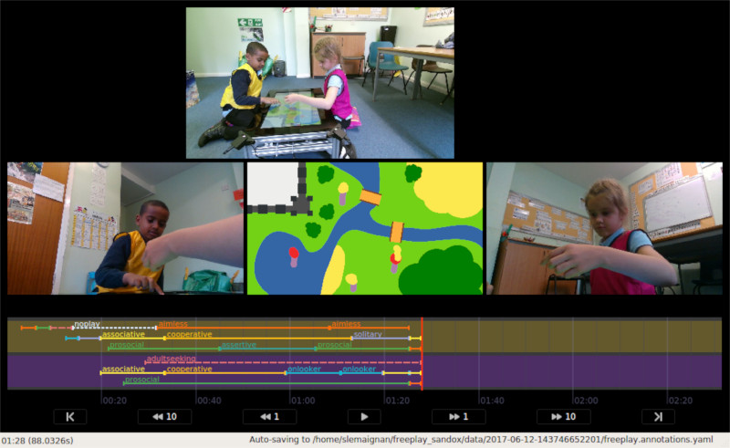

The PInSoRo Dataset
===================

The **PInSoRo Dataset** consists in 75 recordings (45 child-child interactions;
30 child-robot interactions; up to 40 min per interactions) of annotated free
play interactions.

[Get the dataset!](get-dataset)

Dataset Content
---------------

Each recording includes the following datastreams:

| **Domain**    | **Type**                                                           | **Details**                   |
|---------------|--------------------------------------------------------------------|-------------------------------|
| _child 1_     | audio                                                              | 16kHz, mono, semi-directional |
|               | face (RGB)                                                         | qHD (960x540), 30Hz           |
|               | face (depth)                                                       | VGA (640x480), 30Hz           |
|               | facial features                                                    | 70 3D points, 30Hz            |
|               | skeleton                                                           | 15 2D points, 30Hz            |
|               | hands                                                              | 20 x 2 2D points, 30Hz        |
| _child 2_     | audio                                                              | 16kHz, mono, semi-directional |
|               | face (RGB)                                                         | qHD (960x540), 30Hz           |
|               | face (depth)                                                       | VGA (640x480), 30Hz           |
|               | facial features                                                    | 70 3D points, 30Hz            |
|               | skeleton                                                           | 15 2D points, 30Hz            |
|               | hands                                                              | 20 x 2 2D points, 30Hz        |
| _environment_ | RGB                                                                | qHD (960x540), 29.7Hz         |
| _touchscreen_ | background drawing (RGB)                                           | 4Hz                           |
|               | touches                                                            | 6 points multi-touch, 10Hz    |
|               | items position and orientation                                     | (x,y,theta), 10Hz             |
| _annotations_ | timestamped annotations of social behaviours and remarkable events |                               |
| _other_       | static transforms between touchscreen and facial cameras           |                               |
|               | cameras calibration informations                                   |                               |

The facial features, 2D skeletons and hands are detected and tracked using the
[CMU OpenPose](https://github.com/CMU-Perceptual-Computing-Lab/openpose/)
library.

Dataset excerpt
---------------

<video controls src="media/bestof.mp4" poster="media/bestof.jpg">
Sorry, your browser doesn't support embedded videos, 
but don't worry, you can <a href="media/bestof.mp4">download it</a>
and watch it with your favorite video player!
</video>

For evaluation purpose, you can download a short excerpt (10 seconds) of the full dataset here:

[Dataset excerpt (65MB)](dataset/10s-extract.bag)

Annotation of social interactions
---------------------------------

Using an [annotation tool](https://github.com/freeplay-sandbox/annotator/) specifically developped for this purpose, we are currently annotating the entire dataset with **high level social constructs**.

Specifically, the following constructs are annotated:

| **Task Engagement**   |
|-----------------------|
| goal-oriented play    |
| aimless play          |
| adult seeking         |
| no play               |

| **Social Engagement** |
|-----------------------|
| solitary play         |
| onlooker              |
| parallel play         |
| associative play      |
| cooperative play      |

| **Social attitude**   |
|-----------------------|
| pro-social            |
| adversarial           |
| assertive             |
| frustrated            |
| passive    

See [Coding scheme](coding-scheme) for details.

**Note that the video annotations are not completed yet: as of writing (05 Jan
2018), about 75% of the interactions have been annotated.**

Acquisition Procedure
---------------------

To know more about the acquisition procedure, please [refer to the paper *The
PInSoRo dataset: Supporting the data-driven study of child-child and child-robot
social dynamics*](https://doi.org/10.1371/journal.pone.0205999).

Access to the dataset
---------------------

The dataset is publicly available to interested academics (with some
restrictions). [See the details here](get-dataset).

