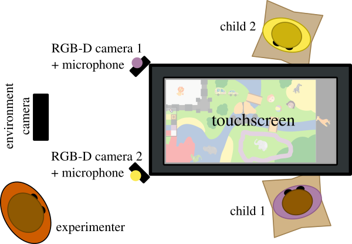

Welcome to the PInSoRo Dataset homepage
=======================================

The **PInSoRo Dataset** (also called _Freeplay Sandbox dataset_) is a large (120
children, 45h+ of RGB-D video recordings), open-data dataset of chid-child and
child-robot social interactions.

These interactions are recorded during little-constrained **free play**
episodes. They emcompass a rich and diverse set of social behaviours.

<video controls src="media/bestof.mp4" poster="media/bestof.jpg">
Sorry, your browser doesn't support embedded videos, 
but don't worry, you can <a href="media/bestof.mp4">download it</a>
and watch it with your favorite video player!
</video>

Dataset Content
---------------

### Recorded data

Each play episode includes the following datastreams:

| **Domain**    | **Type**                                                           | **Details**                   |
|---------------|--------------------------------------------------------------------|-------------------------------|
| _child 1_     | audio                                                              | 16kHz, mono, semi-directional |
|               | face (RGB)                                                         | qHD (960x540), 30Hz           |
|               | face (depth)                                                       | VGA (640x480), 30Hz           |
|               | facial features                                                    | 70 3D points, 30Hz            |
|               | skeleton                                                           | 15 2D points, 30Hz            |
|               | hands                                                              | 20 x 2 2D points, 30Hz        |
| _child 2_     | audio                                                              | 16kHz, mono, semi-directional |
|               | face (RGB)                                                         | qHD (960x540), 30Hz           |
|               | face (depth)                                                       | VGA (640x480), 30Hz           |
|               | facial features                                                    | 70 3D points, 30Hz            |
|               | skeleton                                                           | 15 2D points, 30Hz            |
|               | hands                                                              | 20 x 2 2D points, 30Hz        |
| _environment_ | RGB                                                                | qHD (960x540), 29.7Hz         |
| _touchscreen_ | background drawing (RGB)                                           | 4Hz                           |
|               | touches                                                            | 6 points multi-touch, 10Hz    |
|               | items position and orientation                                     | (x,y,theta), 10Hz             |
| _annotations_ | timestamped annotations of social behaviours and remarkable events |                               |
| _other_       | static transforms between touchscreen and facial cameras           |                               |
|               | cameras calibration informations                                   |                               |

The facial features, 2D skeletons and hands are detected and tracked using the
[CMU OpenPose](https://github.com/CMU-Perceptual-Computing-Lab/openpose/)
library. Watch the video above to get an idea of the accuracy.

### Annotation of social interactions

Using an [annotation tool](https://github.com/freeplay-sandbox/annotator/) specifically developped for this purpose, we are currently annotating the entire dataset with **high level social constructs**.

Specifically, the following constructs are annotated:

| **Task Engagement**   |
|-----------------------|
| goal-oriented play    |
| aimless play          |
| adult seeking         |
| no play               |

| **Social Engagement** |
|-----------------------|
| solitary play         |
| onlooker              |
| parallel play         |
| associative play      |
| cooperative play      |

| **Social attitude**   |
|-----------------------|
| pro-social            |
| adversarial           |
| assertive             |
| frustrated            |
| passive    

See [Coding scheme](coding-scheme) for details.

How to get the dataset
----------------------

For legal and ethical reasons, the dataset is only available to **academics**.

The dataset exists in two flavours:

- the anonymised version, **with no video streams**, that can be freely
  downloaded once you fill in a short ethics declaration online and provide an
  academic email address.

- the full dataset, **include raw video streams**, that can be obtained after
  getting suitable **ethical clearance from your university ethics committee**.
  Due to the size of the full dataset (several terabytes), we share this
  version by shipping to you an (encrypted) harddrive with the data.
  **[Application procedure](application)**.

**The dataset will be available Autumn 2017**

### Dataset excerpt

For evaluation purpose, you can download a short excerpt (10 seconds) of the full dataset here:

[Dataset excerpt (65MB)](dataset/10s-extract.bag)

Acquisition Procedure
---------------------

To know more about the acquisition procedure, please refer to the paper *[paper
under review -- to be added soon]*

If you wish to run the study, the various software components are all
opensource:

- The [core](https://github.com/freeplay-sandbox/core) acquisition and robot
  control pipeline, written in C++ and Python, and using extensively
  [ROS](https://www.ros.org).
- The [user interface](https://github.com/freeplay-sandbox/qt-gui) that is meant
  to run on a large touchscreen, written in Qt QML.
- The [supervisor](https://github.com/freeplay-sandbox/web-supervisor) for the
  experimenter to control the whole system and conveniently record participants
  (Python + HTML)
- The [annotation tool](https://github.com/freeplay-sandbox/annotator) to
  annotate the recorded datasets (C++, requires ROS and Qt).
- [Analysis tools](https://github.com/freeplay-sandbox/analysis) to run pose
  detection and compute various statistics on the dataset (Python, C++).

